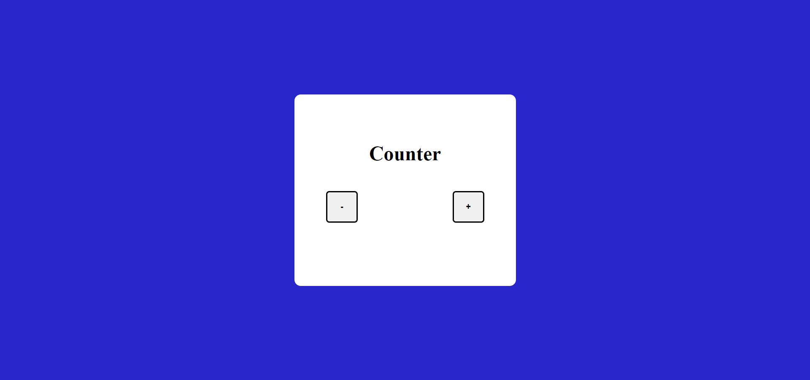
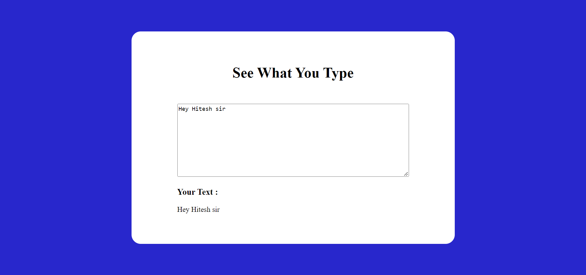
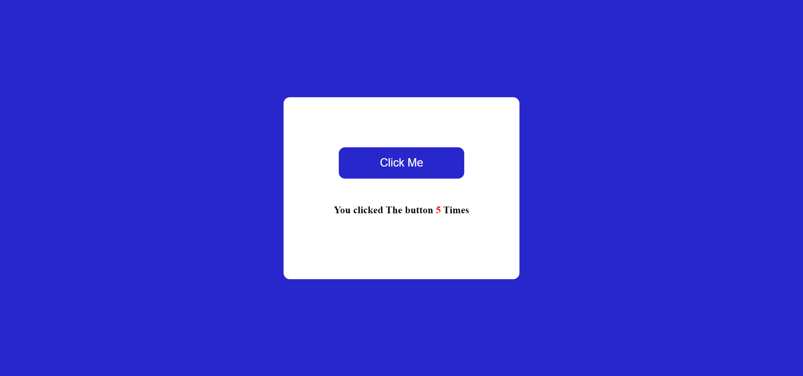
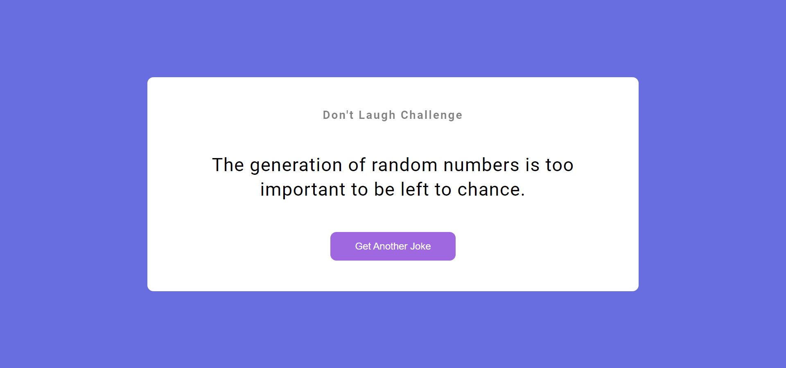

## **Using Technology**
 
 
# 1. Color Changer. 

# 🚀 [LiVE PROJECT LINK](https://voluble-narwhal-485b00.netlify.app/) 
# [code link](https://github.com/Ankush8950/colorChanging)

# 2. Basic Counter.

# 🚀 [LiVE PROJECT LINK](https://incandescent-llama-9a04c7.netlify.app/) 
# [code link](https://github.com/Ankush8950/basicCounter)

# 3. See what you type

# 🚀 [LiVE PROJECT LINK](https://eclectic-rugelach-de023d.netlify.app/) 
# [code link](https://github.com/Ankush8950/SeeWhatYouType)

# 4. Click the button

# 🚀 [LiVE PROJECT LINK](https://inspiring-rabanadas-046c8b.netlify.app/) 
# [code link](https://github.com/Ankush8950/clickThebutton)

# 5. Jokes Generator.

# 🚀 [LiVE PROJECT LINK](https://iridescent-puppy-c693a0.netlify.app/) 
# [code link](https://github.com/Ankush8950/JokesGenerator)
